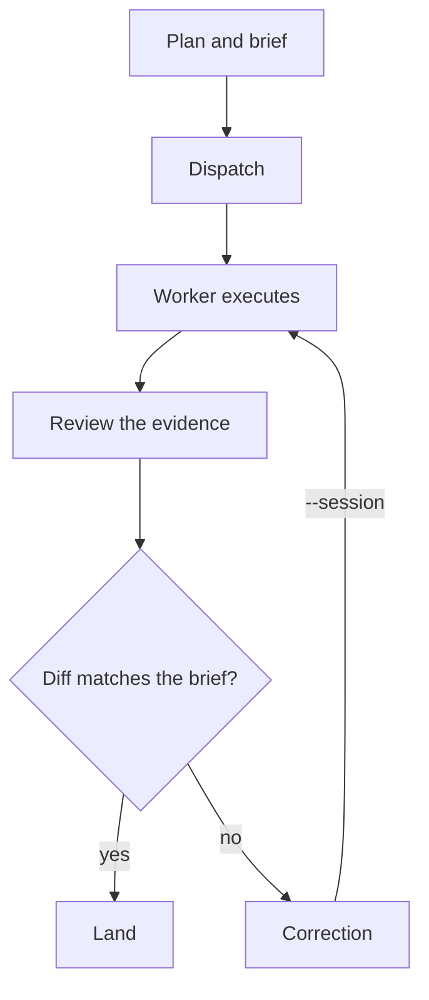
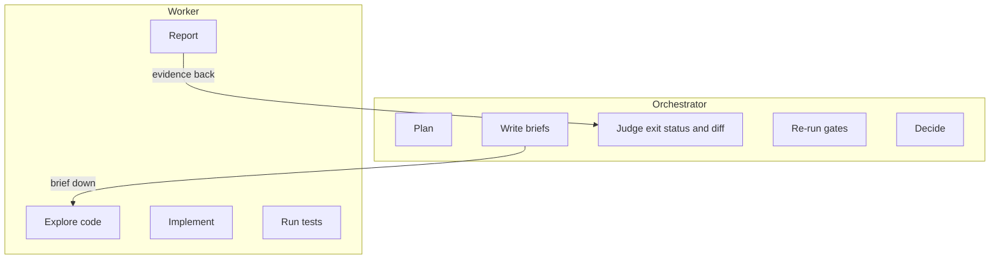
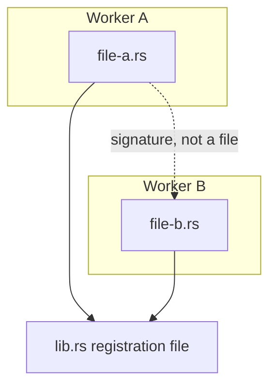
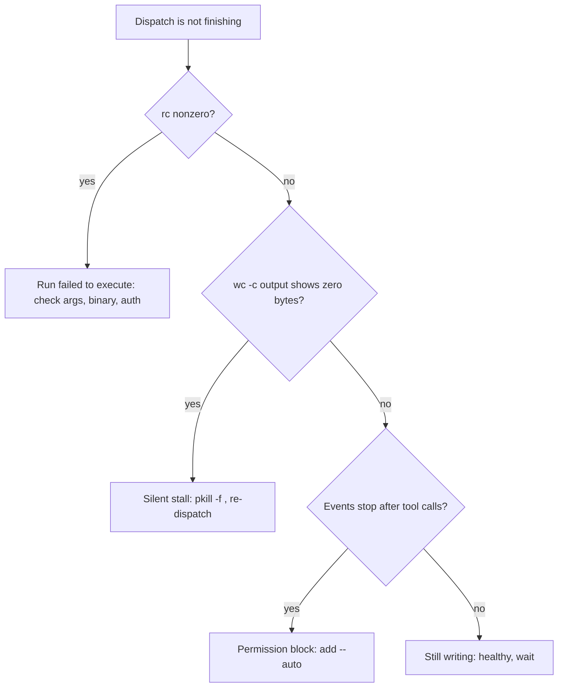

# flywheel

A durable orchestrator-to-worker implementation loop. **Codex or Claude Code** act as the
orchestrator — plan, brief, dispatch, validate. The **OpenCode CLI running DeepSeek**
(`opencode-go/deepseek-v4-pro`) is the worker — code exploration, implementation, tests, and heavy
work. The orchestrator writes precise bounded briefs and judges the evidence; it never implements
the change itself.

The loop in one picture. The `--session` edge is the point: a correction resumes the same worker,
it never restarts it, and the orchestrator never writes the fix.



## Install

```bash
npx skills add go2sujeet/flywheel --skill flywheel
```

Requires the `opencode` CLI installed and authenticated (`opencode auth login`), plus git.

## Usage

Invoke the skill when you want to run an autonomous build/test/fix cycle through the worker, or keep
yourself in the reviewer/validator role.

1. **Plan & brief** — decompose into bounded tasks and write each brief to a file (goal, exact
   change, don't-touch list, task-specific tests, report contract — the worker auto-loads
   AGENTS.md/CLAUDE.md, so omit what it already knows). See
   `skills/flywheel/references/worker-brief.md`; worked examples live in [`examples/`](examples/).
2. **Dispatch (fresh run)** — verify flags (`opencode run --help`), then run the safe quoted file
   brief with `--auto` (required non-interactively), a `--title` label, and `--format json` to
   capture the emitted session id:

   ```bash
   opencode run -m opencode-go/deepseek-v4-pro --auto --title "flywheel-task" --format json \
     "$(cat .flywheel/briefs/<id>.txt)"; rc=$?
   # save rc AND the sessionID emitted in the JSON output — use it for --session below
   ```

   `--auto` is required: without it the worker hangs on a permission prompt nobody can answer the
   first time it writes a file; `opencode.jsonc` permission config is the narrower alternative.

3. **Review** — judge the actual exit status and `git diff`; re-run gates independently when needed.
4. **Correct or land** — send a correction by resuming the **emitted** session id (never an invented
   one); the orchestrator sends implementation changes to the worker, never writes them itself:

   ```bash
   opencode run -m opencode-go/deepseek-v4-pro --auto --session "<emitted-sessionID>" \
     --format json "$(cat .flywheel/briefs/<id>.delta.txt)"
   ```

   `--format json` matters on resumes too: without it the resume emits human-formatted output, not
   JSONL.

Rules: disjoint file ownership for concurrent workers; preserve dirty edits; report the blocker and
halt if the worker is unavailable; no automatic commits/pushes; no secrets in prompts. Fresh runs use
`--auto` + `--title` + `--format json`; `--session` accepts only an existing emitted session id, and
resumes need `--format json` too.

## The boundary

Everything the loop does is split cleanly in two: the orchestrator plans and judges, the worker
executes. Implementation never crosses upward — that single rule is the skill's core invariant.



## Concurrency

Parallel workers are allowed only under disjoint file ownership. But files disjoint does not mean
tasks independent — one task may compile against a signature another task is writing.



Registration files like `lib.rs` are choke points almost every task wants to touch: serialize on
them or give one task sole ownership. Between batches, check `pgrep -f "opencode serve" | wc -l` for
leaked orphans — they accumulate silently and only show up later as unexplained stalls.

## Troubleshooting

When a dispatch is not finishing, branch on the evidence instead of guessing:



| Symptom | Fix |
| --- | --- |
| Worker hangs on the first file write | Re-dispatch with `--auto` (permission block; `opencode.jsonc` is the narrower alternative). |
| Output file has zero bytes after ~30s | Silent stall — confirm with `wc -c`, then reap the wrapper **and its orphans** (recovery block below) and re-dispatch. |
| Exit status `144` | Your own `pkill` — expected, not a worker failure. |
| Resume output is not JSONL | Re-dispatch the resume with `--format json`. |

**Recovery from a stall.** `pkill -f "<the --title value>"` kills only the `opencode run` wrapper —
the orphaned `opencode --session` and `opencode serve` processes survive and cause the NEXT stall.
Reap them and verify before re-dispatching:

```bash
pkill -f "<the --title value>"
pkill -f "opencode --session"
pkill -f "opencode serve"
pgrep -f "opencode serve" | wc -l      # expect 0
pgrep -f "opencode --session" | wc -l   # expect 0
```

The verification is the point — assuming the kill worked cost seven stalls in one session. Do not
verify with a bare `pgrep -fl opencode`: a dispatch passes the brief as an argument, so a brief
mentioning opencode inflates the output into dozens of apparent matches (observed 67 when the real
state was one server and zero orphans). Normal completion also leaks a `serve` process, so if
dispatches stall after a long session, check for orphans before blaming the model or the network.

Full detail lives in `skills/flywheel/references/worker-brief.md` — this table is a scannable
index, not a replacement.
