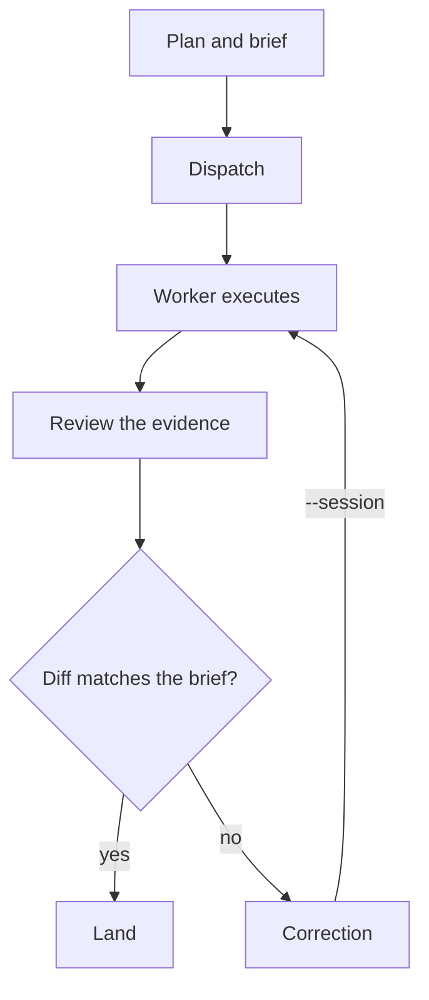

# flywheel

A durable orchestrator-to-worker implementation loop. Frontier-model agents (Claude Code / Codex)
act as the **orchestrator** — plan, brief, dispatch, validate. Cheap disposable agents (OpenCode CLI
running a DeepSeek model) are the **workers** — code exploration, implementation, tests, and heavy
work. The orchestrator writes precise bounded briefs and judges the evidence; it never implements
the change itself.

This repo is both the **framework** (a small Go CLI: control plane + data plane) and the **skill**
(prompt files that teach any agent or human how to drive the loop well).

## The core idea

**Repo is the session.** State lives in the repository as files, not inside any single vendor CLI
session. That is what makes agents swappable: run out of tokens in Claude Code mid-session? A fresh
head (Codex, OpenCode) reads the same state files and continues the same work. The loop survives
any single agent.

**Deterministic shell, non-deterministic agents.** A fixed workflow (plan → brief → dispatch →
review → correct-or-land) rides on top of non-deterministic model agents. The workflow, contracts,
and checks are deterministic; the agents are interchangeable.

## Layout

```
cmd/flywheel/          CLI entry point (subcommand dispatch, flags)
internal/flywheel/     core logic (init scaffold, state)
skills/flywheel/       the skill: how to operate the loop (SKILL.md, references, evals)
examples/              worked brief examples (gmail draft)
.flywheel/             local runtime state (briefs, runs, learnings) — gitignored
```

## Install & validate

```bash
# build and test (single validation command)
go build ./... && go vet ./... && go test ./...

# install the CLI locally
go install ./cmd/flywheel

# scaffold a project's flywheel state
flywheel init --dir <target>
```

## CI/CD

- **`ci`** runs on every PR and push to main: build, vet, and tests on Linux, Windows and macOS,
  gofmt, a cross-compile of all release targets, JSON parsing, and a PR-title check.
- **`release`** keeps one release PR open. Each merge to main updates it with the next version
  and a CHANGELOG.md entry; merging that PR tags `vX.Y.Z`, publishes the GitHub release with the
  changelog notes, and a second job attaches binaries for five platforms plus `checksums.txt`.
- Bump rules, highest wins: `type!` or `BREAKING CHANGE:` → major (minor while major is 0);
  `feat` → minor; `fix`/`perf`/`docs`/`refactor`/`revert` → patch; anything else → no release.
- PRs are squash-merged, so the PR title decides the bump.
- The release PR is opened by GitHub Actions, so CI checks do not run on it (a GITHUB_TOKEN
  limitation).

## The loop

The five steps: **Plan → Brief → Dispatch → Review → Correct-or-land**. Steps 1, 4, and 5 are
orchestrator judgment; 2 and 3 are mechanical.



## CLI (control plane + data plane)

| Command | Plane | What it does |
| --- | --- | --- |
| `flywheel init` | data | Scaffold `flywheel.md` + `.flywheel/state.json` + `.flywheel/briefs/` |
| `flywheel version` | both | Print version |

More subcommands (`run`, `status`, `retry`, `handoff`, ...) are being built by the loop itself —
see the [skill](skills/flywheel/SKILL.md) and `internal/` for the evolving surface.

## Operating the loop (agents and humans)

Any agent — or a human — can drive flywheel. Load the skill, follow the loop, keep the boundary:

- **Orchestrator never implements.** You plan, brief, judge; the worker writes the code.
- **Worker unavailable → report the blocker, don't take over.**
- **No unrequested commits/pushes; no secrets in briefs.**
- **Approved worker model, one knob:** set once in
  [skills/flywheel/SKILL.md](skills/flywheel/SKILL.md) → Invariants.

Full rules: [skills/flywheel/SKILL.md](skills/flywheel/SKILL.md) and
[skills/flywheel/references/worker-brief.md](skills/flywheel/references/worker-brief.md).

## Learnings

`.flywheel/learnings.md` is the dogfood log — every loop writes what it hurt into the design. It is
how the framework improves itself: friction becomes spec.

## License

MIT — see [LICENSE](LICENSE).