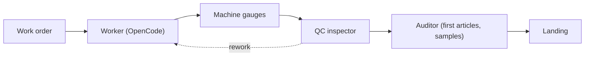
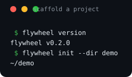
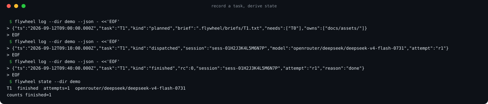
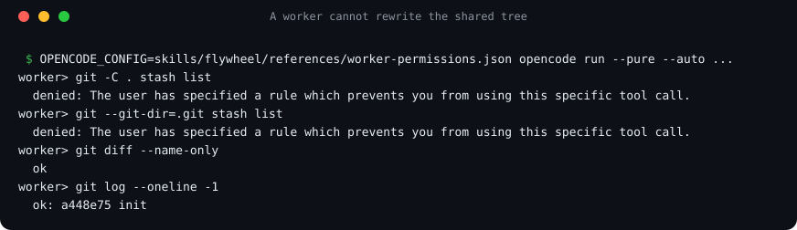

# flywheel

A factory for AI coding agents.

[](https://github.com/go2sujeet/flywheel/actions)
[](https://github.com/go2sujeet/flywheel/releases)
[](LICENSE)

## The factory

Flywheel is a factory for AI coding work: a small Go CLI plus agent skills that run a durable
**orchestrator-to-worker loop**. A frontier lead agent plans, briefs and judges; cheap disposable
worker agents (OpenCode) do the reading, writing and testing. The **control plane** dispatches
work and enforces policy; the **data plane** keeps traceability, telemetry and accountability for
every session.

### Roles

| Factory role | Persona | Does | Never |
| --- | --- | --- | --- |
| Plant manager | lead | sets goals and policy, handles escalations, signs off | implements |
| Production planner | planner | turns a spec into work orders (`owns:`/`needs:`/gates) | dispatches or inspects |
| Line supervisor | foreman | runs a line of workers, retries by policy, pulls the cord | plans or implements |
| Line worker | worker (OpenCode) | builds one work order at its own station | plans, inspects, commits |
| Machine gauges | supervisor (CLI, no model) | measures every unit: runs gates, checks `owns:` | judges intent |
| QC inspector | inspector | inspects a unit against its work order | runs gauges or fixes units |
| External auditor | auditor | audits first articles and samples, files nonconformances | works the line |
| Continuous improvement | steward | turns signals and nonconformances into learnings | changes units |
| Owner | operator | installs, assigns roles, sets merge and publish policy | — |

### A unit's path



### Set up, run, watch

- **Set up** — `flywheel init` scaffolds `flywheel.md` plus the `.flywheel/` state files
  (available in v0.2.0). Building the full factory — lines, staffing, and the policy that keeps it
  safe — is [epic #69](https://github.com/go2sujeet/flywheel/issues/69).
- **Run** — today the lead records each work order as an event with `flywheel log --kind planned`;
  [flywheel run #20](https://github.com/go2sujeet/flywheel/issues/20) (in progress) will dispatch
  OpenCode workers and record their runs automatically.
- **Watch** — `flywheel state` derives the floor from the event log (available in v0.2.0); the live
  [flywheel factory #63](https://github.com/go2sujeet/flywheel/issues/63) dashboard is planned.

Design priorities, in order: **efficiency and consistency**, then **speed, reliability and
recoverability** — the lead spends tokens only where judgment is needed, gauges and telemetry cost
no tokens, and everything replays from the log after any crash.

## Why flywheel

Frontier-quality results at a fraction of frontier cost — measured, not promised: the field run
behind the skills used **99 worker runs across 44 tasks, up to 7 workers in parallel, and about
90 % of all worker input across the field run served from the model cache**.

The goal is to ship with no human in the loop. That is only safe if every step is **recorded** (an
append-only event log), **measured** by the machine (gauges run by the CLI, never self-reported by
an agent), and **audited** by independent checkers. Today the repo has the event log with
`flywheel log` / `flywheel state`, the project config, the worker deny policy, and the persona
skills; the gauges ([#55](https://github.com/go2sujeet/flywheel/issues/55)), isolated inspection
([#24](https://github.com/go2sujeet/flywheel/issues/24)), external audit
([#61](https://github.com/go2sujeet/flywheel/issues/61)) and the run dispatcher
([#20](https://github.com/go2sujeet/flywheel/issues/20)) are being built.

Any agent can lead. The loop lives in repository files and shell commands, not inside any one
vendor's session, so a new head — Claude Code, Codex, OpenCode, or a human — reads the same state
and continues the same work.

## How it works

The loop is five steps: **Plan → Brief → Dispatch → Review → Correct-or-land**. Steps 1, 4 and 5
are lead judgment; 2 and 3 are mechanical.

**Repo is the session.** All state lives in the repository as files — the event log, work orders,
worker plans, reports — not inside any vendor session. That is what makes agents swappable and the
loop crash-safe: run out of tokens, hit a host timeout, lose a watcher; the next head reads the
same files and continues, and nothing is lost.

Two design docs define the factory:

- [Autonomous shipping: the flywheel factory](docs/design/autonomous-shipping.md) — the factory
  model, the required events, the poka-yoke transition rules, and the enforcement layers.
- [Flywheel at scale](docs/design/flywheel-at-scale.md) — personas, many parallel workers,
  per-task worktrees and landing, native feedback, and offline use.

## See it

Real transcripts from this branch, rendered from actual CLI output.

*`flywheel init` scaffolds `flywheel.md` plus the `.flywheel/` state files.*



*A task's life is recorded in the append-only event log; state is derived from the log, not stored
alongside it.*



*Real output: the worker's tree-rewriting git commands are refused even under `--auto`; read-only
git still works.*



## Quickstart

1. **Get the CLI.** Download **flywheel-v0.2.0-\<os\>-\<arch\>.zip** from the
   [Releases page](https://github.com/go2sujeet/flywheel/releases) — Windows binaries ship as
   `flywheel-v0.2.0-windows-amd64.exe.zip` — plus `checksums.txt`. Or build from source:

   ```bash
   git clone https://github.com/go2sujeet/flywheel.git && cd flywheel
   mkdir -p bin && go build -o bin/flywheel ./cmd/flywheel
   ```

   `go install github.com/go2sujeet/flywheel/cmd/flywheel@latest` is not supported yet: go.mod
   declares the module as `flywheel`, not `github.com/go2sujeet/flywheel`, so there is no
   installable module path ([#74](https://github.com/go2sujeet/flywheel/issues/74)).

2. **Install the skills** into your agent — one per skill folder below:

   ```bash
   npx skills add go2sujeet/flywheel --skill flywheel
   npx skills add go2sujeet/flywheel --skill flywheel-worker
   # ... flywheel-planner, flywheel-foreman, flywheel-inspector,
   #     flywheel-auditor, flywheel-steward, flywheel-operator
   ```

3. **Scaffold a project:**

   ```bash
   flywheel init --dir demo
   ```

4. **Run.** Ask your lead agent to load the `flywheel` skill and drive the loop: plan → brief →
   dispatch → review → correct-or-land. The lead writes precise bounded briefs, dispatches OpenCode
   workers, and judges the evidence. Today the lead records each event with `flywheel log`;
   `flywheel run` (in progress, [#20](https://github.com/go2sujeet/flywheel/issues/20)) will record
   runs automatically.

## CLI

| Command | Status | What it does |
| --- | --- | --- |
| `flywheel version` | available (v0.2.0) | Print the flywheel version. |
| `flywheel init` | available (v0.2.0) | Scaffold `flywheel.md` + `.flywheel/state.json` + `.flywheel/events.jsonl` + `.flywheel/briefs/`. |
| `flywheel log` | available (v0.2.0) | Append an event to `.flywheel/events.jsonl` and re-derive state. |
| `flywheel state` | available (v0.2.0) | Derive and print state from the event log. |
| `flywheel config` | in progress ([#20](https://github.com/go2sujeet/flywheel/issues/20)) | Read and validate `.flywheel/config.json` (config package merged). |
| `flywheel run` | in progress ([#20](https://github.com/go2sujeet/flywheel/issues/20)) | Dispatch an OpenCode worker and capture the run. |
| `flywheel status` | planned ([#21](https://github.com/go2sujeet/flywheel/issues/21)) | Classify the state of runs and tasks. |
| `flywheel watch` | planned ([#22](https://github.com/go2sujeet/flywheel/issues/22)) | Watch the line, one readable line per transition. |
| `flywheel validate` / `flywheel supervise` | planned ([#55](https://github.com/go2sujeet/flywheel/issues/55)) | Machine gauges: measure finished units, run the gates. |
| `flywheel verify` | planned ([#54](https://github.com/go2sujeet/flywheel/issues/54)) | Check the event log and the transition rules. |
| `flywheel inspect` | planned ([#24](https://github.com/go2sujeet/flywheel/issues/24)) | Isolated review of a finished unit in its own worktree. |
| `flywheel audit` | planned ([#61](https://github.com/go2sujeet/flywheel/issues/61)) | External audit of first articles and samples. |
| `flywheel land` | planned ([#45](https://github.com/go2sujeet/flywheel/issues/45)) | Local landing queue: rebase, re-measure, fast-forward. |
| `flywheel factory` | planned ([#63](https://github.com/go2sujeet/flywheel/issues/63)) | Live terminal dashboard of the floor; bare `flywheel` opens it ([#69](https://github.com/go2sujeet/flywheel/issues/69)). |
| `flywheel explain`, `flywheel context` | planned ([#58](https://github.com/go2sujeet/flywheel/issues/58)) | A task's traveler; the factory state sized for a joining agent. |
| `flywheel trace` | planned ([#62](https://github.com/go2sujeet/flywheel/issues/62)) | Everything one session did, across tasks. |
| `flywheel feedback` | planned ([#37](https://github.com/go2sujeet/flywheel/issues/37)–[#40](https://github.com/go2sujeet/flywheel/issues/40)) | Turn signals into learnings; export and submit upstream. |

## Skills

Each role ships as a skill folder any agent can load:

- [`flywheel`](skills/flywheel/SKILL.md) — the lead: drive the loop, judge evidence, never implement.
- [`flywheel-planner`](skills/flywheel-planner/SKILL.md) — write work orders; never dispatch.
- [`flywheel-foreman`](skills/flywheel-foreman/SKILL.md) — run a line of OpenCode workers; retry by policy.
- [`flywheel-worker`](skills/flywheel-worker/SKILL.md) — execute one brief, run its gates, report evidence.
- [`flywheel-inspector`](skills/flywheel-inspector/SKILL.md) — QC verdicts: pass, rework, scrap, escalate.
- [`flywheel-auditor`](skills/flywheel-auditor/SKILL.md) — independent audit of first articles and samples.
- [`flywheel-steward`](skills/flywheel-steward/SKILL.md) — turn signals and nonconformances into learnings.
- [`flywheel-operator`](skills/flywheel-operator/SKILL.md) — install, configure, assign personas.

## Roadmap

Three epics drive the factory:

- [#10](https://github.com/go2sujeet/flywheel/issues/10) — the factory core: the append-only event
  log, project config, and built-in feedback.
- [#35](https://github.com/go2sujeet/flywheel/issues/35) — flywheel at scale: native feedback,
  personas, many workers, offline.
- [#51](https://github.com/go2sujeet/flywheel/issues/51) — autonomous shipping: a unit's full path
  from work order to landing, with no human in the loop.

## CI/CD

- **`ci`** runs on every PR and push to main: build, vet and tests on Linux, Windows and macOS,
  gofmt, a cross-compile of all release targets, a JSON parse check, and a PR-title check.
- **`release`** keeps one release PR open; merging it tags `vX.Y.Z`, publishes the GitHub release,
  and attaches binaries for five platforms plus `checksums.txt`.
- Bump rules, highest wins: `type!` or `BREAKING CHANGE:` → major (minor while major is 0);
  `feat` → minor; `fix`/`perf`/`docs`/`refactor`/`revert` → patch; anything else → no release.
  PRs are squash-merged, so the PR title decides the bump. The release PR is opened by GitHub
  Actions, so CI checks do not run on it (a `GITHUB_TOKEN` limitation).

## Learnings

Consumer repos keep their learnings in `.flywheel/learnings.md` — the log of what hurt, so friction
becomes spec (flywheel will generate it from signals,
[#38](https://github.com/go2sujeet/flywheel/issues/38)). This repo gitignores that file and tracks
its own learnings as issues under [epic #10](https://github.com/go2sujeet/flywheel/issues/10).

## License

MIT — see [LICENSE](LICENSE).